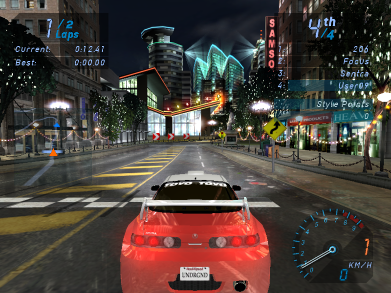
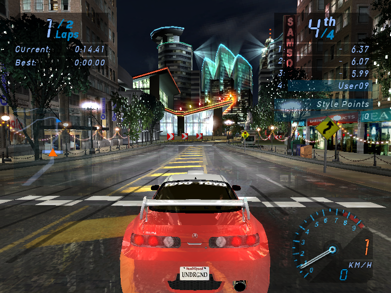
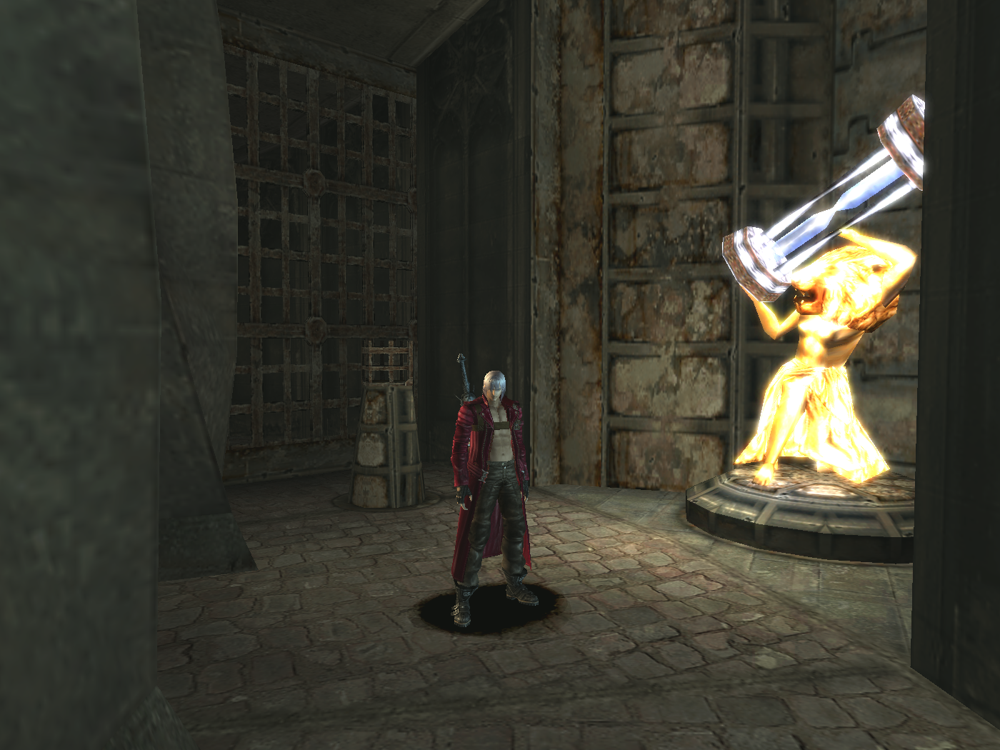
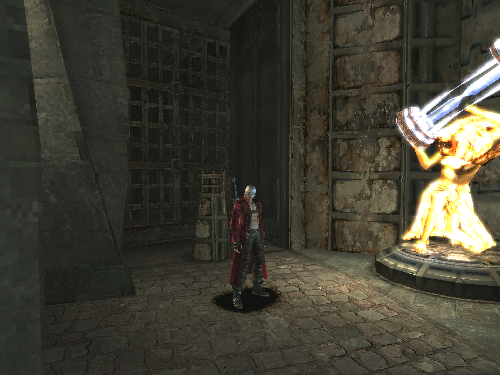
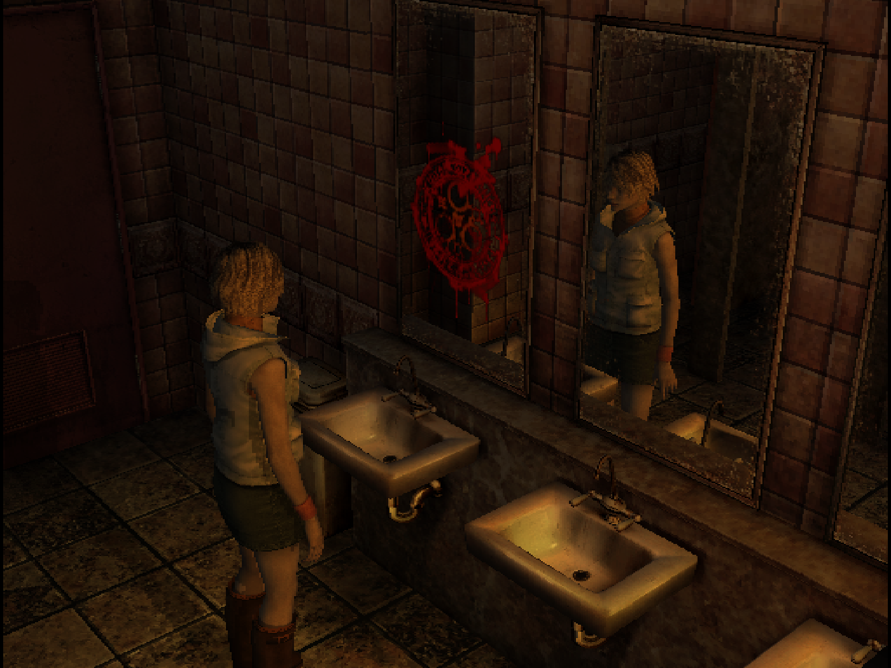

# RetroPixel DirectX Wrapper

A lightweight, zero-overhead Direct3D 8 and Direct3D 9 wrapper designed to force **Nearest Neighbor (Point) filtering** in classic PC games. Say goodbye to blurry bilinear filtering and enjoy crisp, pixel-perfect retro graphics.

## 🚀 Features
* **True Pixel-Perfect Rendering:** Overrides hardware texture filtering to force `D3DTEXF_POINT`.
* **Zero Overhead:** Uses low-level Assembly Trampoline hooks. No performance drops, no stuttering.
* **Smart Scaling Fix:** Contains specific fixes for games like *Silent Hill 3* to prevent scaling bugs and screen zooming.
* **No Dependencies:** Written in pure C++ without heavy libraries like Detours or MinHook.

## 🎮 Confirmed Working Games
* *Need for Speed: Underground* (DX9)
* *Devil May Cry 3* (DX9)
* *Silent Hill 3* (DX8) - *Includes smart mipmap bypassing*

📸 Click to compare (Screenshots Before / After)

### Need for Speed: Underground
**Before (Bilinear):**

**After (Point):**

---

### Devil May Cry 3
**Before (Bilinear):**

**After (Point):**

---

### Silent Hill 3
**Before (Bilinear):**

**After (Point):**

## 🛠️ Installation
1. Go to the **[Releases](../../releases)** tab on the right side of this page.
2. Download the latest `.zip` archive.
3. Extract `d3d9.dll` (for DirectX 9 games) or `d3d8.dll` (for DirectX 8 games) into the folder where the game's main `.exe` is located.
4. Launch the game and enjoy crisp pixels! *A `proxy_log.txt` will be generated in the game folder to confirm the wrapper is active.*

## ⚙️ How it Works (Under the Hood)
Unlike standard wrappers that simply create a proxy VTable, this project uses **Inline Trampoline Hooking**. Many older games or third-party mods (like Widescreen Fixes) wrap the Direct3D device, bypassing standard VTable hooks. This wrapper directly patches the binary machine code of `d3d9.dll` and `d3d8.dll` in memory for functions like `SetTexture` and `SetSamplerState`, ensuring the filtering override cannot be bypassed by the game engine.

## 🤝 Credits
Developed by [alexey318] / [User09] and inspired by the pursuit of preserving retro game aesthetics.
